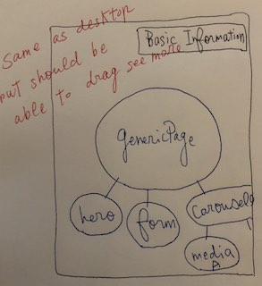
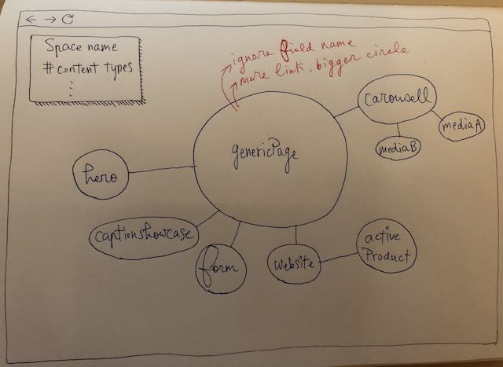

# Visualization tool for the content model in Contentful

## Contentful

[Contentful](https://www.contentful.com/) is a headless content management system (CMS). It serves as a database for our marketing website pages.

## Content Model

Contentful define an abstract term called "content type". A content type can be a page, a component or some configs on the website. Inside a content type, we can add fields to it and link the field to another content type. For example, we create a generic page content type, put a headline field, a description field and a section field that could link to other content types like form or help section. Together with all of these, we call it the content model of our website. 

## Visualization Tool

Usually, after times, the content model becomes more and more complex and could contain hundreds of content types. A visualization tool can help us to understand the relationship between content types and identify possible improvement. 

## How to do it

### Language/Framework

- ReasonML
- React (not sure if we need it or not)

### Get data from Contentful

- Dump contentful space with [contentful-export](https://github.com/contentful/contentful-export)
- Query content type on the fly [API](https://www.contentful.com/developers/docs/references/content-delivery-api/)

### D3 force

- [d3-force](https://observablehq.com/@d3/disjoint-force-directed-graph?collection=@d3/d3-force)
- [d3-force tutorial](https://tomroth.com.au/d3/)

### D3 with ReasonML/React

- [bs-d3](https://github.com/af/bs-d3)
- [vx](https://github.com/hshoff/vx#readme)

## Expected Result

### Happy Path 1

1. User provide necessary data to query content model 
2. Render content model with d3-force

### Happy Path 2

TBD